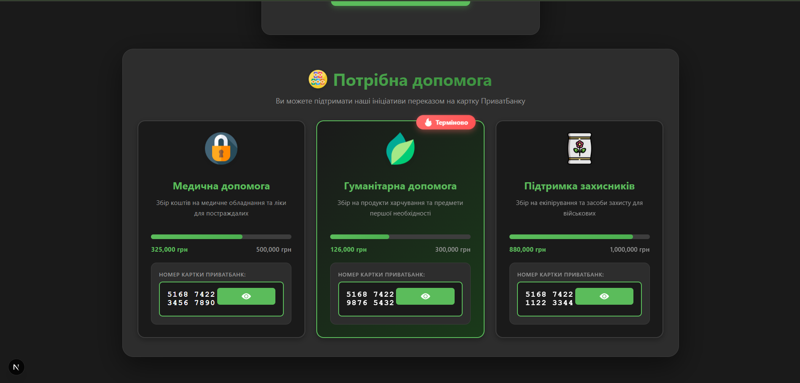
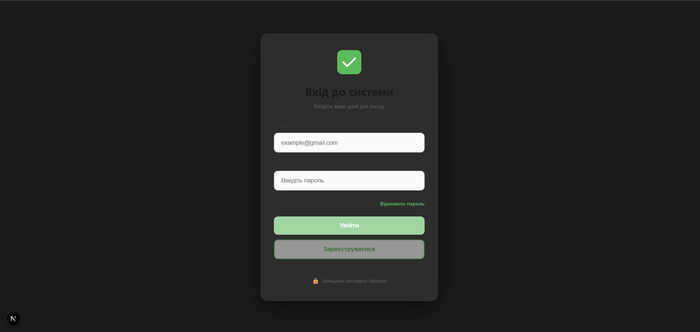

# 🏦 MagicLink - Банківська система

### Dashboard - Привітання


### Dashboard - Картки допомоги


### Головна сторінка - Вхід/Реєстрація


## 🚀 Технології

- **Next.js 16.1.1** - React фреймворк
- **TypeScript** - типізація
- **CSS3** - стилізація з анімаціями
- **Flaticon** - SVG іконки
- **MongoDB** - база даних

## 📦 Встановлення

### Локально

1. Клонуй репозиторій:
```bash
git clone <your-repo-url>
cd magiclink
```

2. Встанови залежності:
```bash
npm install
```

3. Створи файл `.env.local`:
```env
NEXT_PUBLIC_API_URL=http://localhost:3000
```

4. Запусти dev сервер:
```bash
npm run dev
```

Open [http://localhost:3000](http://localhost:3000) with your browser to see the result.

## 🌐 Деплой на Vercel

### Крок 1: Підготовка

1. Створи GitHub репозиторій
2. Запуш код:
```bash
git init
git add .
git commit -m "Initial commit"
git remote add origin <your-github-repo>
git push -u origin main
```

### Крок 2: Деплой

1. Зареєструйся на [Vercel](https://vercel.com)
2. Натисни **"New Project"**
3. Import свій GitHub репозиторій
4. Налаштуй:
   - **Framework Preset**: Next.js
   - **Build Command**: `npm run build`
   - **Output Directory**: `.next`
5. Додай Environment Variable:
   - `NEXT_PUBLIC_API_URL` = `http://localhost:3000` (або URL твого бекенду)
6. Натисни **"Deploy"**

## 📝 Scripts

```bash
npm run dev      # Запуск dev сервера
npm run build    # Білд для production
npm run start    # Запуск production сервера
npm run lint     # Перевірка коду
```

## 🗄️ База даних

Проект використовує MongoDB для зберігання:
- Користувачів
- Карток
- Транзакцій
- Налаштувань

## 🔐 Безпека

- Паролі хешуються через bcrypt
- Email верифікація
- JWT токени для авторизації

## 📱 Функціонал

- ✅ Реєстрація та вхід
- ✅ Перегляд балансу
- ✅ Управління картками
- ✅ Історія транзакцій
- ✅ Переказ коштів
- ✅ Налаштування профілю
- ✅ Підтримка

## 🛠️ Розробка

Проект має повний функціонал банківської системи з динамічними даними, які зберігаються в MongoDB.

## 📄 Ліцензія

MIT